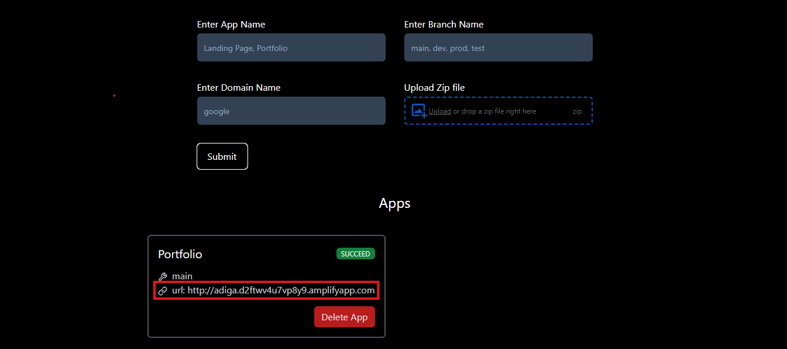

# Web Hosting

## Introduction
Developed a web hosting platform using technologies like Node.js, AWS Amplify, Express.js, and MongoDB. This platform allows users to effortlessly host their websites by uploading their frontend projects. 

### Key features of this project include:

* **AWS Integration**: Utilizing AWS Amplify SDK for hosting websites, ensuring scalability and reliability.
* **Ease of Use**: Users can upload their zip files and host their projects easily, making web hosting accessible to those without extensive technical knowledge.
* **TypeScript Implementation**: Enhances development speed and reduces errors by providing static typing.

## Prerequisites
Node v20.10.0\
Npm V10.8.1

## Installation
**1. Clone the repository:**
```
git clone https://github.com/adiga27/web-hosting.git
cd web-hosting
```
**2. Install dependencies:**
1. Backend dependencies
```
npm install
```
2. Frontend dependencies
```
cd client
npm install
```
**3. Change a `.env.example` file to `.env`**
1. Backend `.env` in the root directory
```
PORT = 5000

# MongoDB Databse connection
DATABASE_URL = mongodb+srv://<username>:<paassword>@cluster-name/database-name

#Add AWS Credentials from IAM user of AWS
W_AWS_REGION =
W_AWS_ACCESS_KEY =
W_AWS_SECRET_KEY =
```
2. Frontend `.env` in the client directory
```
NEXT_PUBLIC_SERVER = http://localhost:5000
```

**4. Run the server**
1. Backend server
```
npm start
```
2. Frontend server
```
cd client
npm run dev
```

**5. Add details and upload frontend project in zip format**
* files in zip files:\
    project.zip\
    |\
    |__index.html *required\
    |__style.css\
    |__script.js

 

**6. Output returns URL**
